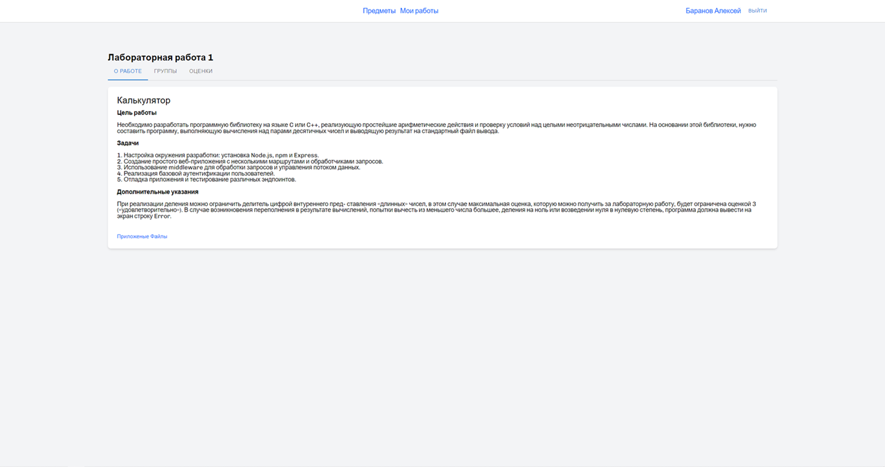
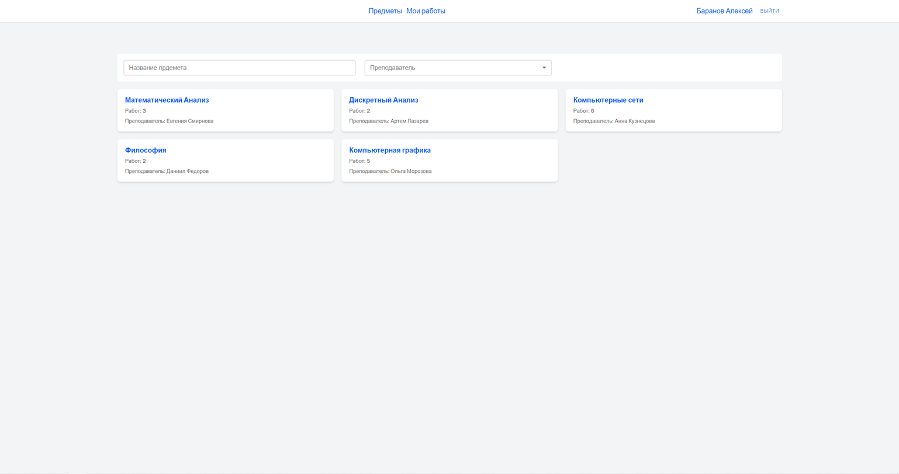

# ВКР Баранов Алексей Денисович
---
## Тема: Web-приложение для ведения и оценки групповых работ
## Цель работы: Разработка web-приложения для взаимодействия преподавателя и студентов при ведении групповых работ

## Как запустить?
```
docker compose up -d
```
## О приложении

### Stack
#### Frontend: 
+ React
+ MUI
+ Typescript
+ Node.js
+ Docker

#### Backend:
+ Node.js
+ Typescript
+ Express.js
+ Docker

## Демонстрация функционала




Профиль пользователя. Доступен список предметов с необходимой информацией о дедлайнах и текущих работах




Страница с доступными предметами. Присутствует фильтр для удобного поиска нужного предмета


Страница предмета. Есть меню с выбором нужного функционала, просмтр групп или выставление оценок. Присутствует описание предмета